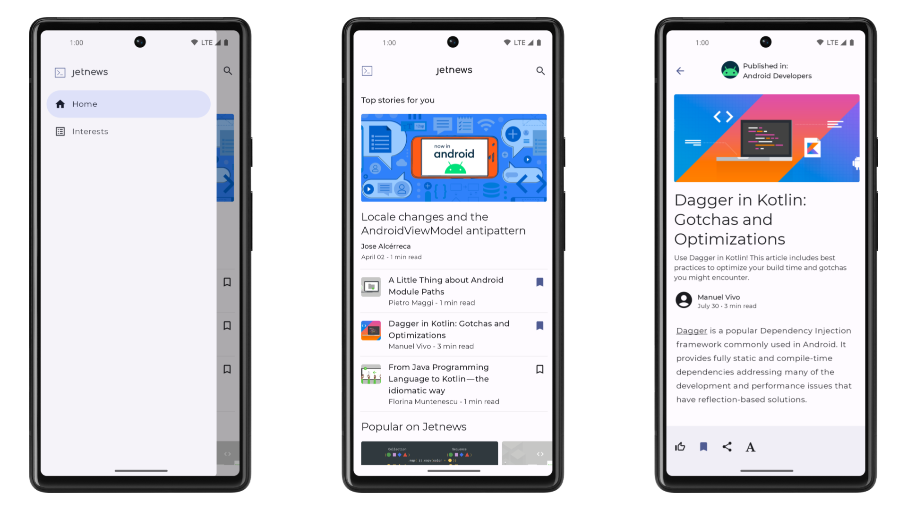
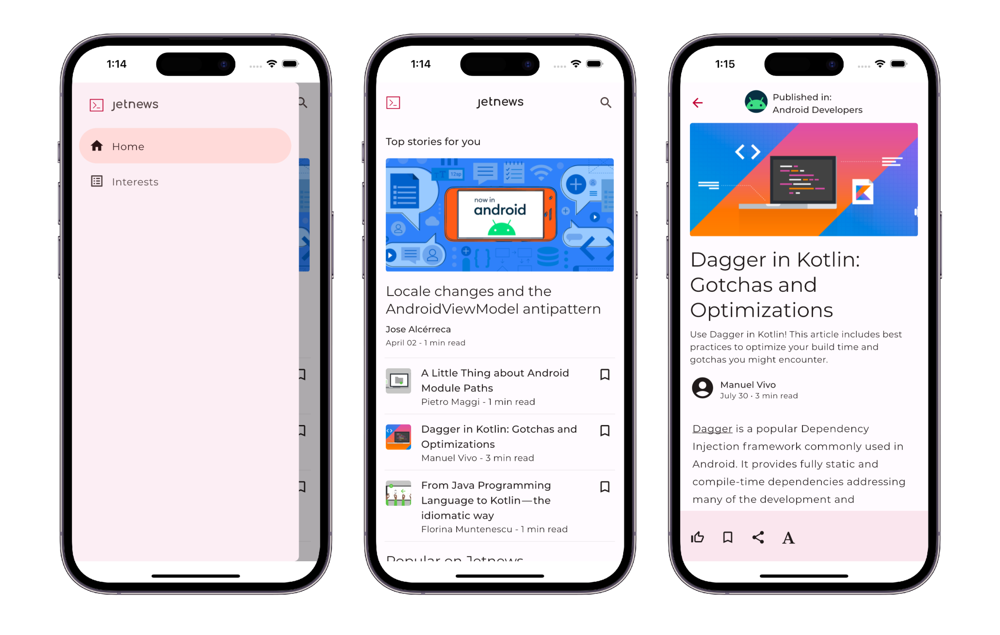
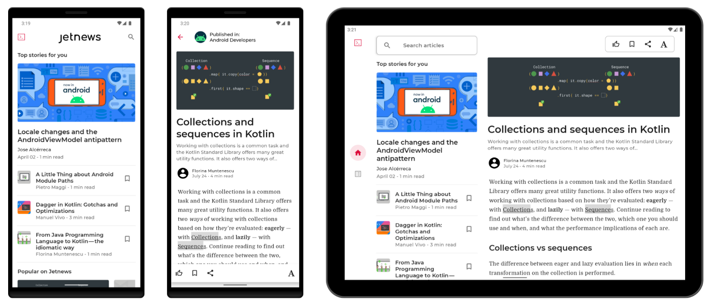
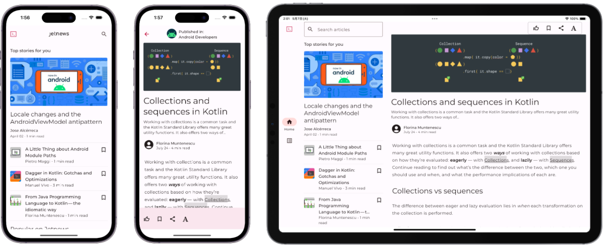

# Jetnews sample by Kotlin Multiplatform

Jetnews sample を multi-module 化をして、KMP対応したものである

multi-module のサンプルと [Jetpack Compose (for Android)](https://developer.android.com/jetpack/compose) / [Compose Multiplatform](https://www.jetbrains.com/ja-jp/lp/compose-multiplatform/) の機能を評価を目的としています。

## Screenshots

### Android 版



### iOS 版



## Features

Jetnews sample から App scaffolding と 画面実装を feature モジュールに切り分けている

* composeApp
* feature:home
* feature:article
* feature:interests

実装内容は Jetnews sample から以下の点を変更したのみである

* multi-module に分解
* KMP 対応のライブラリを依存へ置き換え
  * Compose Multiplatform 1.7.3
  * [Lifecycle 2.8.4](https://www.jetbrains.com/help/kotlin-multiplatform-dev/compose-lifecycle.html) ([Android](https://developer.android.com/jetpack/androidx/releases/lifecycle))
  * [Navigation 2.8.0-alpha02](https://www.jetbrains.com/help/kotlin-multiplatform-dev/compose-navigation-routing.html) ([Android](https://developer.android.com/jetpack/androidx/releases/navigation))
  * [WindowSizeClass](https://www.jetbrains.com/help/kotlin-multiplatform-dev/whats-new-compose-170.html#material3-material3-window-size-class) ([Android](https://developer.android.com/jetpack/androidx/releases/navigation))
* Toast を [Snackbar](https://m3.material.io/components/snackbar/overview) へ置き換え
* Android の App resources を [Images and resources](https://www.jetbrains.com/help/kotlin-multiplatform-dev/compose-images-resources.html) へ置き換え
* Android Context を [`KmpContext`](core/ui/src/commonMain/kotlin/com/example/jetnews/core/ui/KmpContext.kt) へ置き換え

制限事項

* Compose Multiplatform の Images and resources の一部で参照エラーで Compose Preview 機能が余り良く機能しない。
* Dialog が上手く表示出来ていない
* Color の一部が Platform 間で異なるケースがある
* AppWidget glance は Android 特有の機能のため Android 限定になっている

## Jetnews for every screen and every platform

3rd party ライブラリを使っているが、Android/iOS ともに同じコードでタブレット対応が実現出来ている。





## License

```
Copyright 2021 The Android Open Source Project

Licensed under the Apache License, Version 2.0 (the "License");
you may not use this file except in compliance with the License.
You may obtain a copy of the License at

    https://www.apache.org/licenses/LICENSE-2.0

Unless required by applicable law or agreed to in writing, software
distributed under the License is distributed on an "AS IS" BASIS,
WITHOUT WARRANTIES OR CONDITIONS OF ANY KIND, either express or implied.
See the License for the specific language governing permissions and
limitations under the License.
```
